# Install GitLab on Microsoft Azure

> _This article was originally written by Dave Wentzel and [published on the GitLab Blog][Original-Blog-Post]._
>
> _Ported to the GitLab documentation and updated on 2017-08-24 by [Ian Scorer](https://gitlab.com/iscorer)._

Azure is Microsoft's business cloud and GitLab is a pre-configured offering on the Azure Marketplace. 
Hopefully, you aren't surprised to hear that Microsoft and Azure have embraced open source software 
like Ubuntu, Red Hat Enterprise Linux, and of course - GitLab! This means that you can spin up a 
pre-configured GitLab VM and have your very own private GitLab up and running in around 30 minutes. 
Let's get started.

## Getting started

First, you'll need an account on Azure. There are three ways to do this:

- If your company (or you) already has an account, then you are ready to go!
- You can also open your own Azure account for free. _At time of writing_, you get $200 
of credit to spend on Azure services for 30 days. You can use this credit to try out paid Azure 
services, exploring Microsoft's cloud for free. Even after the first 30 days, you never have to pay
anything unless you decide to transition to paid services with a Pay-As-You-Go Azure subscription. 
This is a great way to try out Azure and cloud computing, and you can 
[read more in their comprehensive FAQ][Azure-Free-Account-FAQ].
- If you have an MSDN subscription, you can activate your Azure subscriber benefits. Your MSDN 
subscription gives you recurring Azure credits every month, so why not put those credits to use and 
try out GitLab right now?

## Working with Azure

Once you have an Azure account, you can get started. Login to Azure using 
[portal.azure.com](https://portal.azure.com) and the first thing you will see is the Dashboard:

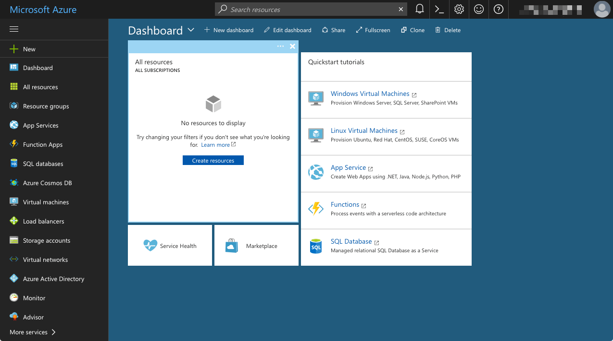

The Dashboard gives you a quick overview of Azure resources, and from here you you can build VMs, 
create SQL Databases, author websites, and perform lots of other cloud tasks.

## Create New VM

The [Azure Marketplace][Azure-Marketplace] is an online store for pre-configured applications and 
services which have been optimized for the cloud by software vendors like GitLab,
available on the Azure Marketplace as pre-configured solutions. In this tutorial
we will install GitLab Community Edition, but for GitLab Enterprise Edition you
can follow the same process.

To begin creating a new GitLab VM, click on the **+ New** icon, type "GitLab" into the search 
box, and then click the **"GitLab Community Edition"** search result:

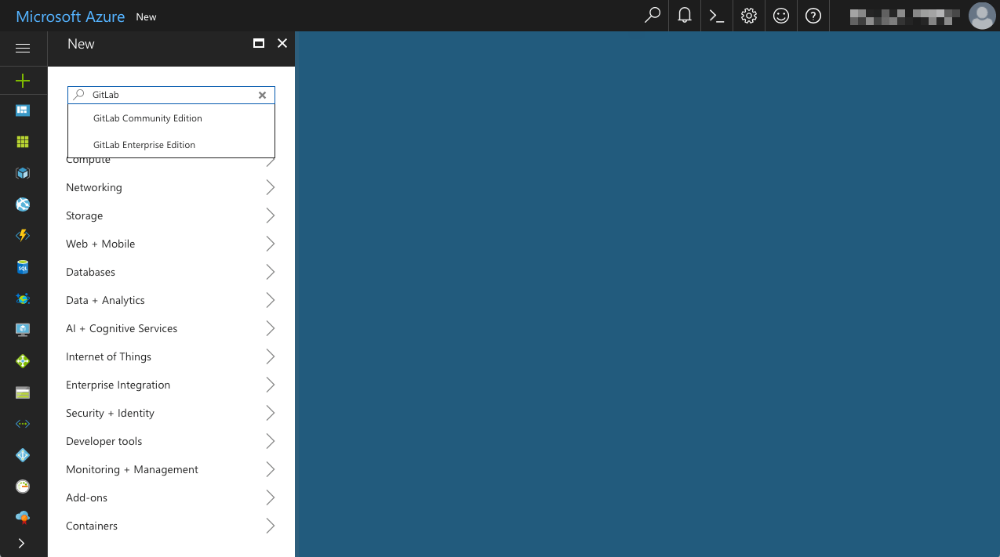

A new "blade" window will pop-out, where you can read more about the **"GitLab Community Edition"** 
offering which is freely available under the MIT Expat License:

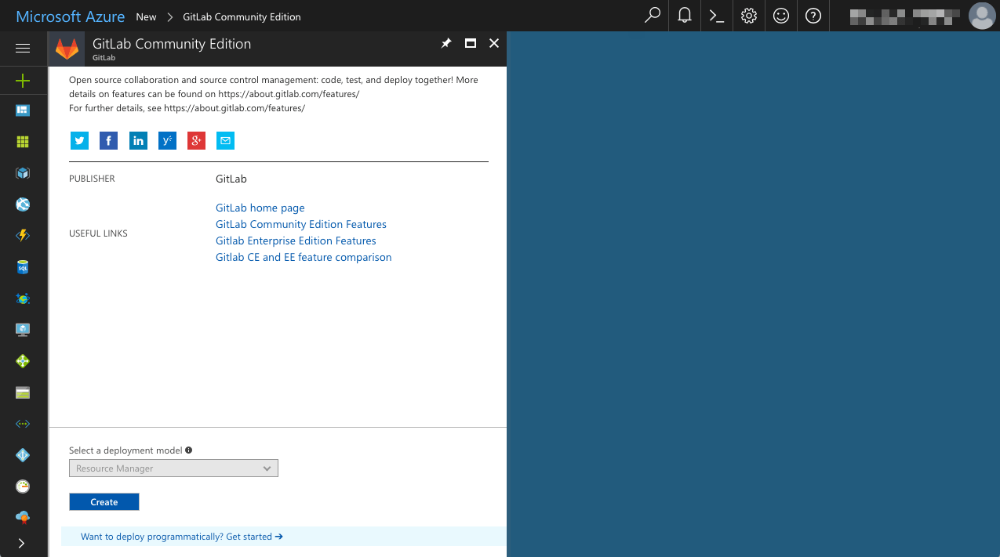

Click **"Create"** and you will be presented with the "Create virtual machine" blade:

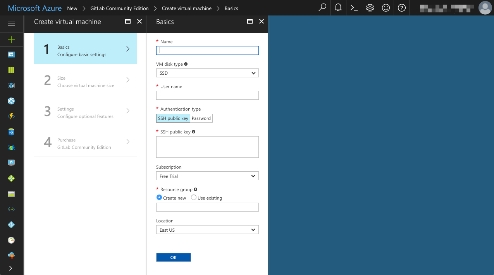

## Basics

The first items we need to configure are the basic settings of the underlying virtual machine:

1. Enter a `Name` for the VM - e.g. **"GitLab-CE"**
1. Select a `VM disk type` - either **HDD** _(slower, lower cost)_ or **SSD** _(faster, higher cost)_
1. Enter a `User name` - e.g. **"gitlab-admin"**
1. Select an `Authentication type`, either **SSH public key** or **Password**:
    
    > **Note:** if you're unsure which authentication type to use, select **Password**

    1. If you chose **SSH public key** - enter your `SSH public key` into the field provided 
    _(read the [SSH documentation][GitLab-Docs-SSH] to learn more about how to setup SSH 
    public keys)_
    1. If you chose **Password** - enter the password you wish to use _(this is the password that you 
    will use later in this tutorial to [SSH] into the VM, so make sure it's a strong password/passphrase)_
1. Choose the appropriate `Subscription` tier for your Azure account
1. Choose an existing `Resource Group` or create a new one - e.g. **"GitLab-CE-Azure"**

    > **Note:** a "Resource group" is a way to group related resources together for easier administration. 
    > We chose "GitLab-CE-Azure", but your resource group can have the same name as your VM.

1. Choose a `Location` - if you're unsure, select the default location

Here are the settings we've used:

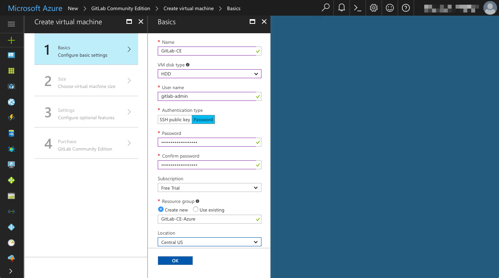

Check the settings you have entered, and then click **"OK"** when you're ready to proceed.

## Size

Next, you need to choose the size of your VM - selecting features such as the number of CPU cores, 
the amount of RAM, the size of storage (and its speed), etc.

> **Note:** in common with other cloud vendors, Azure operates a resource/usage pricing model, i.e. 
the more resources your VM consumes the more it will cost you to run, so make your selection 
carefully. You'll see that Azure provides an _estimated_ monthly cost beneath each VM Size to help
guide your selection.

The default size - the lowest cost **"DS1_V2 Standard"** VM - meets the minimum system requirements 
to run a small GitLab environment for testing and evaluation purposes, and so we're going to go 
ahead and select this one, but please choose the size which best meets your own requirements:

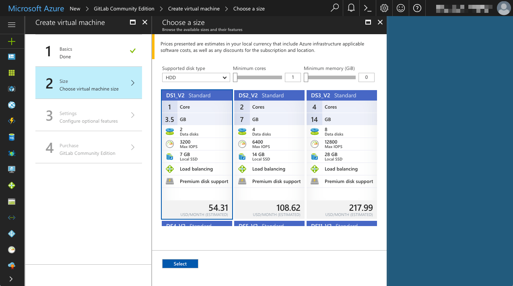

> **Note:** be aware that whilst your VM is active (known as "allocated"), it will incur 
"compute charges" which, ultimately, you will be billed for. So, even if you're using the 
free trial credits, you'll likely want to learn 
[how to properly shutdown an Azure VM to save money][Azure-Properly-Shutdown-VM].

Go ahead and click your chosen size, then click **"Select"** when you're ready to proceed to the
next step.

## Settings

On the next blade, you're asked to configure the Storage, Network and Extension settings. 
We've gone with the default settings as they're sufficient for test-driving GitLab, but please 
choose the settings which best meet your own requirements:

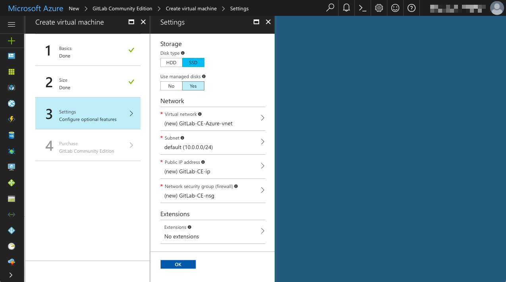

Review the settings and then click **"OK"** when you're ready to proceed to the last step.

## Purchase

The Purchase page is the last step and here you will be presented with the price per hour for your 
new VM. You'll be billed only for the VM itself (e.g. "Standard DS1 v2") because the 
**"GitLab Community Edition"** marketplace solution is free to use at 0 USD/hr:

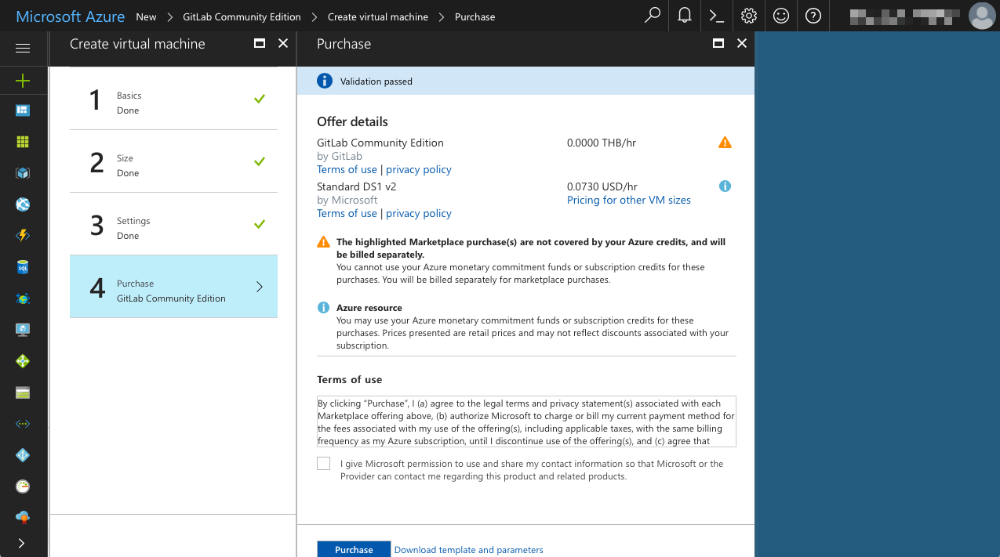

> **Note:** at this stage, you can review and modify the any of the settings you have made during all 
previous steps, just click on any of the four steps to re-open them.

When you have read and agreed to the terms of use and are ready to proceed, click **"Purchase"**.

## Deployment

At this point, Azure will begin deploying your new VM. The deployment process will take a few 
minutes to complete, with progress displayed on the **"Deployment"** blade:

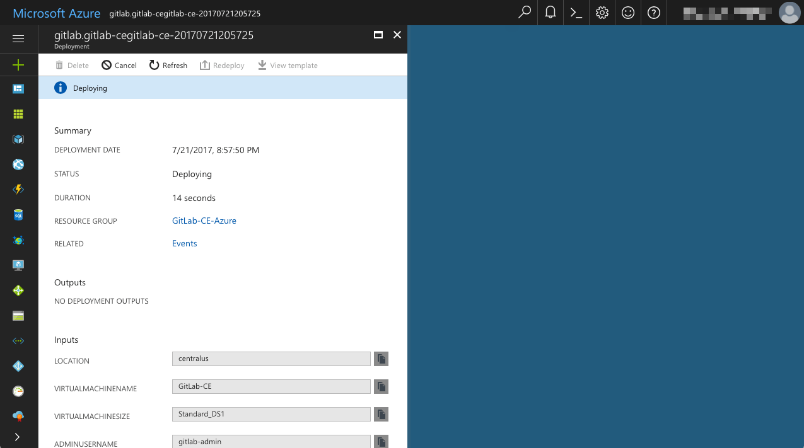

Once the deployment process is complete, the new VM and its associated resources will be displayed 
on the Azure Dashboard (you may need to refresh the page):

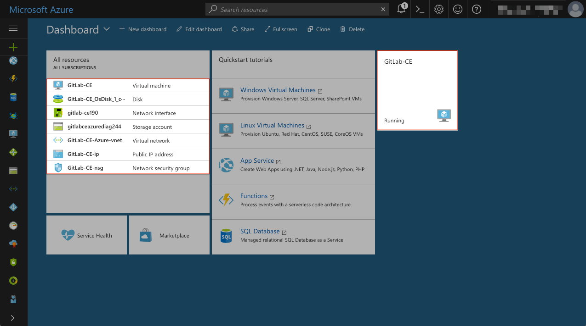

The new VM can also be accessed by clicking the `All resources` or `Virtual machines` icons in the 
Azure Portal sidebar navigation menu.

## Setup a domain name

The VM will have a public IP address (static by default), but Azure allows us to assign a friendly 
DNS name to the VM, so let's go ahead and do that.

From the Dashboard, click on the **"GitLab-CE"** tile to open the management blade for the new VM. 
The public IP address that the VM uses is shown in the 'Essentials' section:

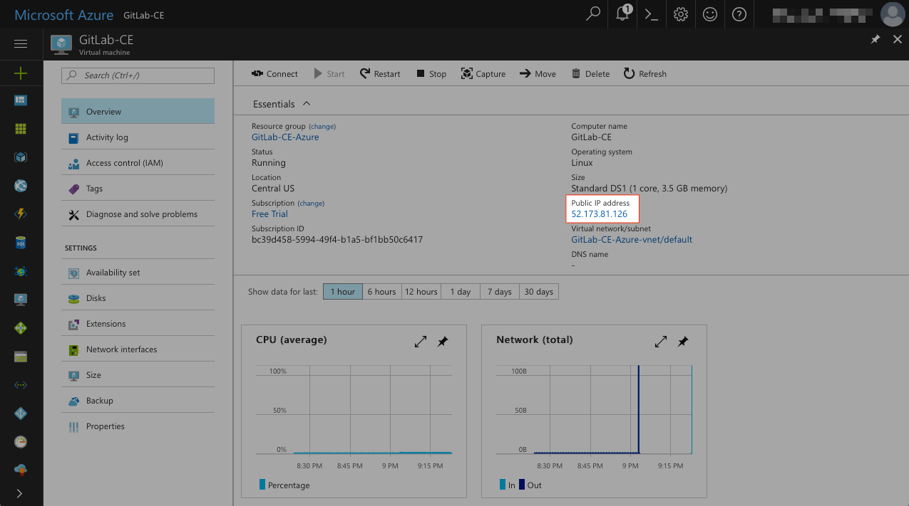

Click on the public IP address - which should open the **"Public IP address - Configuration"** blade, 
then click on **"Configuration"** (under "Settings"). Now enter a friendly DNS name for your instance 
in the `DNS name label` field:

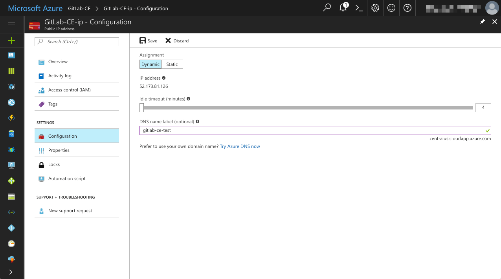

In the screenshot above, you'll see that we've set the `DNS name label` to **"gitlab-ce-test"**. 
This will make our VM accessible at `gitlab-ce-test.centralus.cloudapp.azure.com` 
_(the full domain name of your own VM will be different, of course)_. 

Click **"Save"** for the changes to take effect.

> **Note:** if you want to use your own domain name, you will need to add a DNS `A` record at your 
domain registrar which points to the public IP address of your Azure VM. If you do this, you'll need 
to make sure your VM is configured to use a _static_ public IP address (i.e. not a _dynamic_ one) 
or you will have to reconfigure the DNS `A` record each time Azure reassigns your VM a new public IP 
address. Read [IP address types and allocation methods in Azure][Azure-IP-Address-Types] to learn more.

## Let's open some ports!

At this stage you should have a running and fully operational VM. However, none of the services on 
your VM (e.g. GitLab) will be publicly accessible via the internet until you have opened up the 
necessary ports to enable access to those services.

Ports are opened by adding _security rules_ to the **"Network security group"** (NSG) which our VM 
has been assigned to. If you followed the process above, then Azure will have automatically created 
an NSG named `GitLab-CE-nsg` and assigned the `GitLab-CE` VM to it. 

> **Note:** if you gave your VM a different name then the NSG automatically created by Azure will 
also have a different name - the name you have your VM, with `-nsg` appended to it.

You can navigate to the NSG settings via many different routes in the Azure Portal, but one of the 
simplest ways is to go to the Azure Dashboard, and then click on the Network Security Group listed 
in the **"All resources"** tile:

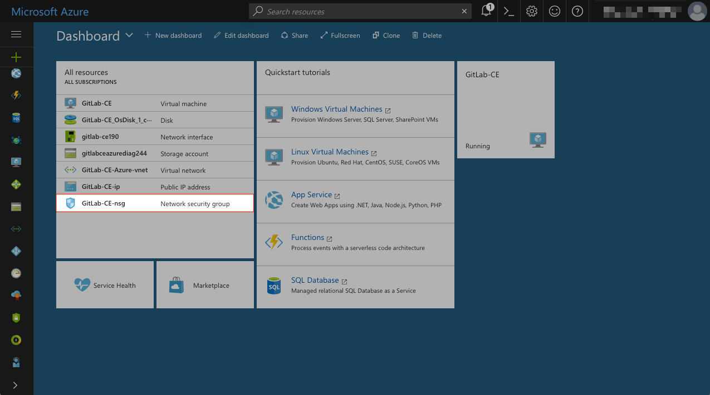

With the **"Network security group"** blade open, click on **"Inbound security rules"** under 
**"Settings"**:

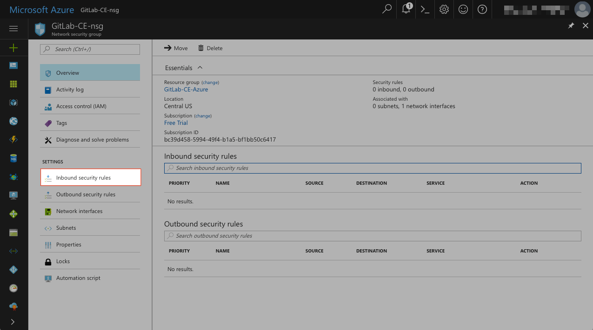

Next, click **"Add"**:

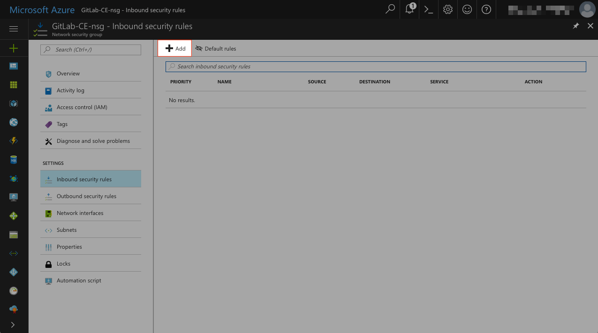

### Which ports to open?

Like all servers, our VM will be running many services. However, we want to open up the correct 
ports to enable public internet access to two services in particular:

1. **HTTP** (port 80) - opening port 80 will enable our VM to respond to HTTP requests, allowing 
public access to the instance of GitLab running on our VM.
1. **SSH** (port 22) - opening port 22 will enable our VM to respond to SSH connection requests, 
allowing public access (with authentication) to remote terminal sessions 
_(you'll see why we need [SSH] access to our VM [later on in this tutorial](#maintaining-your-gitlab-instance))_

### Open HTTP on Port 80

In the **"Add inbound security rule"** blade, let's open port 80 so that our VM will accept HTTP 
connections:


1. Enter **"HTTP"** in the `Name` field
1. Select **HTTP** from the options in the `Service` drop-down
1. Make sure the `Action` is set to **Allow**
1. Click **"OK"**

### Open SSH on Port 22

Repeat the above process, adding a second Inbound security rule to open port 22, enabling our VM to 
accept [SSH] connections:

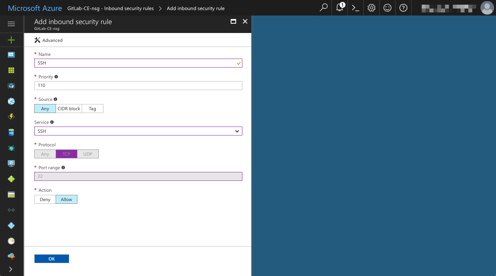

1. Enter **"SSH"** in the `Name` field
1. Select **SSH** from the options in the `Service` drop-down
1. Make sure the `Action` is set to **Allow**
1. Click **"OK"**


It will take a moment for Azure to add each new Inbound Security Rule (and you may need to click on 
**"Inbound security rules"** to refresh the list), but once completed, you should see the two new 
rules in the list:

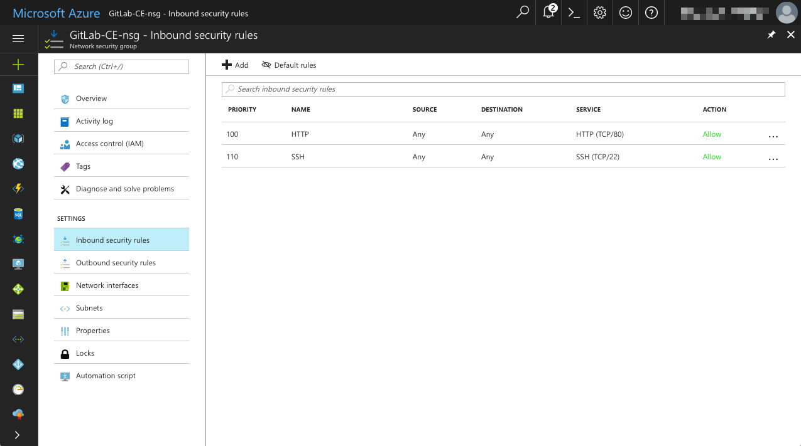

## Connecting to GitLab
Use the domain name you set up earlier (or the public IP address) to visit your new GitLab instance 
in your browser. If everything has gone according to plan you should be presented with the 
following page, asking you to set a _new_ password for the administrator account automatically
created by GitLab:

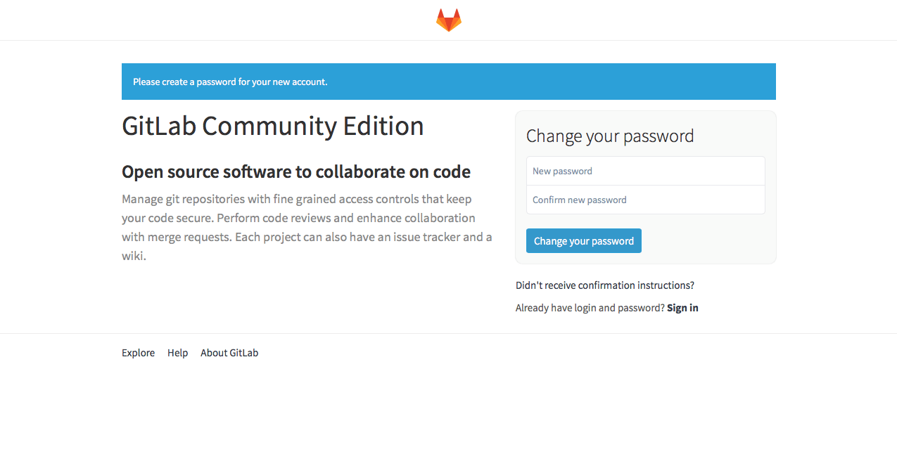

Enter your _new_ password into both form fields, and then click **"Change your password"**.

Once you have changed the password you will be redirected to the GitLab login page. Use `root` as 
the username, enter the new password you set in the previous step, and then click **"Sign in"**:

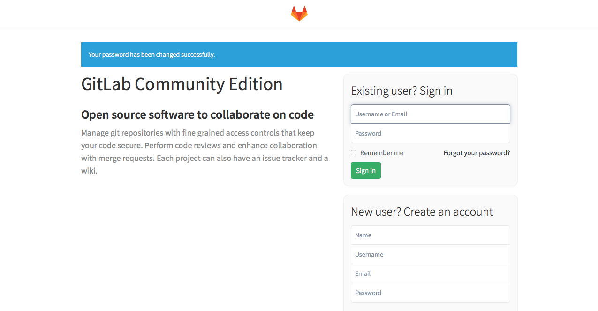

### Success?

After signing in successfully, you should see the GitLab Projects page displaying a 
**"Welcome to GitLab!"** message:

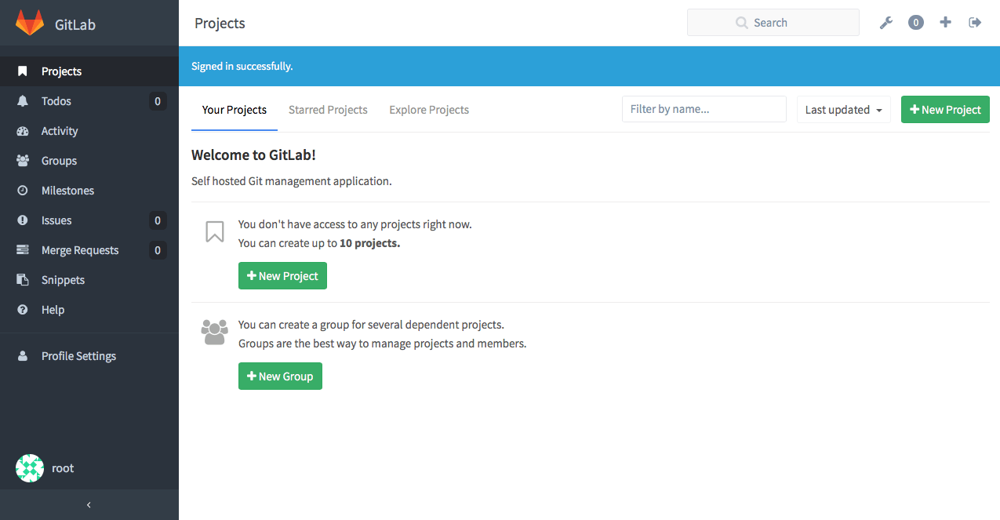

If so, you now have a working GitLab instance on your own private Azure VM. **Congratulations!** 

## Creating your first GitLab project

You can skip this section if you are familiar with Git and GitLab. Otherwise, let's create our first 
project. From the Welcome page, click **"New Project"**.

Let's give our project a name and a description, and then accept the default values for everything 
else:

1. Enter **"demo"** into the `Project path` project name field
1. Enter a `description`, e.g. **"My awesome demo project!"**
1. Click **"Create project"**

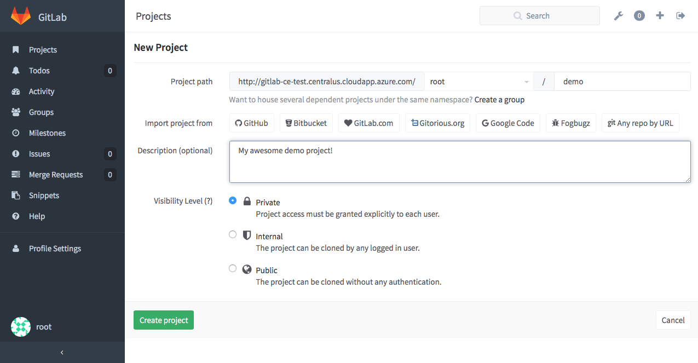

Once the new project has been created (which should only take a moment), you'll be redirected to 
homepage for the project:

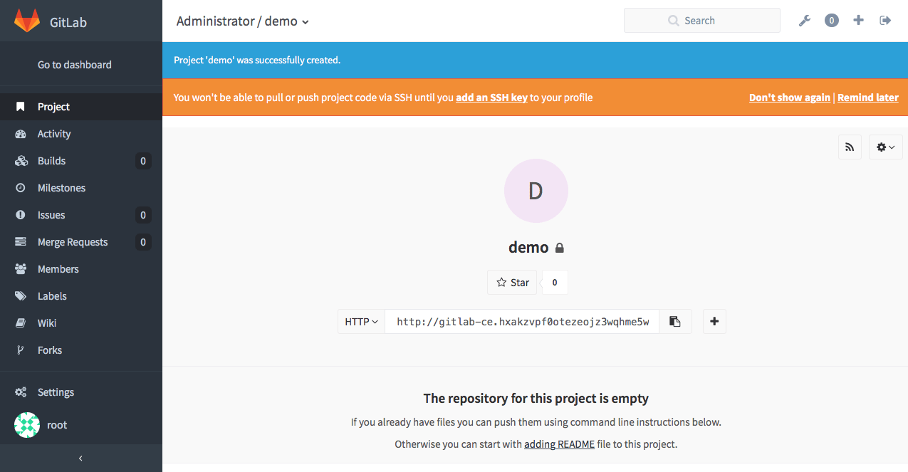

If you scroll further down the project's home page, you'll see some basic instructions on how to 
setup a local clone of your new repository and push and pull from it:

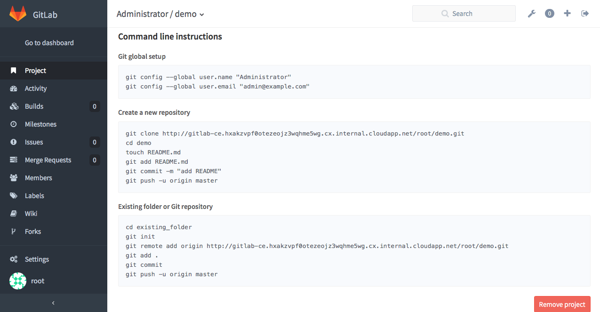

**That's it! You now have your own private GitLab environment installed and running in the cloud!**

## Maintaining your GitLab instance

It's important to keep your GitLab environment up-to-date. The GitLab team is constantly making 
enhancements and occasionally you may need to update for security reasons. So let's review how to 
update GitLab. 

### Checking our current version

To check which version of GitLab we're currently running, click on the "Admin Area" link - it's the
the wrench icon displayed in the top-right, next to the search box. 

In the following screenshot you can see an **"update asap"** notification message in the top-right. 
This particular message indicates that there is a newer version of GitLab available which contains 
one or more security fixes:

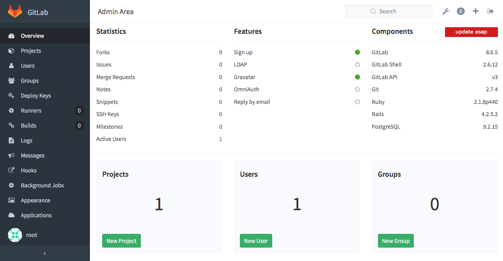

Under the **"Components"** section, we can see that our VM is currently running version `8.6.5` of 
GitLab. This is the version of GitLab which was contained in the Azure Marketplace 
**"GitLab Community Edition"** offering we used to build the VM when we wrote this tutorial. 

> **Note:** The version of GitLab in your own VM instance may well be different, but the update 
process will still be the same.

### Connect via SSH

To perform an update, we need to connect directly to our Azure VM instance and run some commands 
from the terminal. Our Azure VM is actually a server running Linux (Ubuntu), so we'll need to 
connect to it using SSH ([Secure Shell][SSH]). 

If you're running Windows, you'll need to connect using [PuTTY] or an equivalent Windows SSH client. 
If you're running Linux or macOS, then you already have an SSH client installed. 

> **Note:** 
> - Remember that you will need to login with the username and password you specified 
>   [when you created](#basics) your Azure VM
> - If you need to reset your VM password, read 
>   [how to reset SSH credentials for a user on an Azure VM][Azure-Troubleshoot-SSH-Connection].

#### SSH from the command-line

If you're running [SSH] from the command-line (terminal), then type in the following command to 
connect to your VM, substituting `username` and `your-azure-domain-name.com` for the correct values. 

Again, remember that your Azure VM domain name will be the one you 
[setup previously in the tutorial](#set-up-a-domain-name). If you didn't setup a domain name for 
your VM, you can use the IP address in its place in the following command:

```bash
ssh username@your-azure-domain-name.com
```
Provide your password at the prompt to authenticate.

#### SSH from Windows (PuTTY)

If you're using [PuTTY] in Windows as your [SSH] client, then you might want to take a quick 
read on [using PuTTY in Windows][Using-SSH-In-Putty].

### Updating GitLab

Once you've logged in via SSH, enter the following command to update GitLab to the latest
version:

```bash
sudo apt-get update && sudo apt-get install gitlab-ce
```

This command will update GitLab and its associated components to the latest versions, so it will 
take a little time to complete. You'll see various update tasks being completed in your SSH 
terminal window:

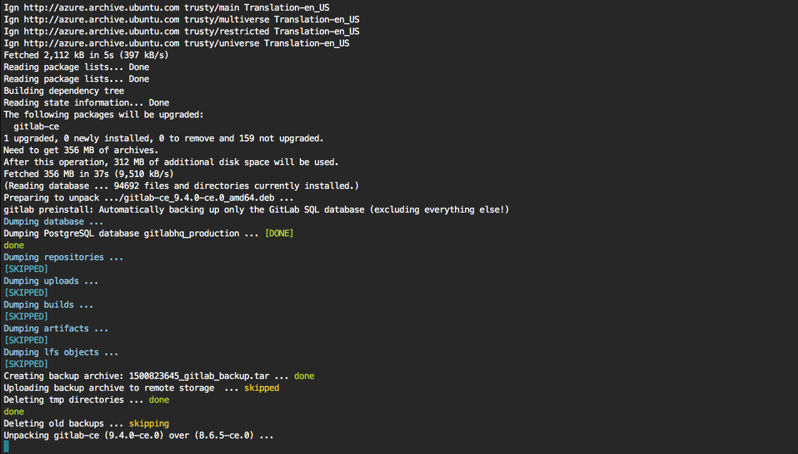

Once the update process has completed, you'll see a message like this:

```
Upgrade complete! If your GitLab server is misbehaving try running

   sudo gitlab-ctl restart

before anything else.
```

#### Check out your updated GitLab

Refresh your GitLab instance in the browser and navigate to the Admin Area. You should now have an 
up-to-date GitLab instance. 

When we wrote this tutorial our Azure VM GitLab instance was updated to the latest version at time 
of writing (`9.4.0`). You can see that the message which was previously displaying **"update asap"** 
is now showing **"up-to-date"**:

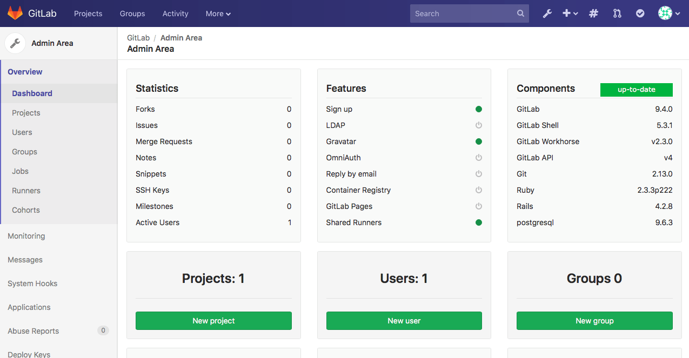

## Conclusion

Naturally, we believe that GitLab is a great git repository tool. However, GitLab is a whole lot 
more than that too. GitLab unifies issues, code review, CI and CD into a single UI, helping you to 
move faster from idea to production, and in this tutorial we showed you how quick and easy it is to 
setup and run your own instance of GitLab on Azure, Microsoft's cloud service. 

Azure is a great way to experiment with GitLab, and if you decide (as we hope) that GitLab is for 
you, you can continue to use Azure as your secure, scalable cloud provider or of course run GitLab
on any cloud service you choose.

## Where to next?

Check out our other [Technical Articles][GitLab-Technical-Articles] or browse the [GitLab Documentation][GitLab-Docs] to learn more about GitLab.

### Useful links

- [GitLab Community Edition][CE]
- [GitLab Enterprise Edition][EE]
- [Microsoft Azure][Azure]
    - [Azure - Free Account FAQ][Azure-Free-Account-FAQ]
    - [Azure - Marketplace][Azure-Marketplace]
    - [Azure Portal][Azure-Portal]
    - [Azure - Pricing Calculator][Azure-Pricing-Calculator]
    - [Azure - Troubleshoot SSH Connections to an Azure Linux VM][Azure-Troubleshoot-SSH-Connection]
    - [Azure - Properly Shutdown an Azure VM][Azure-Properly-Shutdown-VM]
- [SSH], [PuTTY] and [Using SSH in PuTTY][Using-SSH-In-Putty]

[Original-Blog-Post]: https://about.gitlab.com/2016/07/13/how-to-setup-a-gitlab-instance-on-microsoft-azure/ "How to Setup a GitLab Instance on Microsoft Azure"
[GitLab-Docs]: https://docs.gitlab.com/ce/README.html "GitLab Documentation"
[GitLab-Technical-Articles]: https://docs.gitlab.com/ce/articles/index.html "GitLab Technical Articles"
[GitLab-Docs-SSH]: https://docs.gitlab.com/ce/ssh/README.html "GitLab Documentation: SSH"
[CE]: https://about.gitlab.com/features/
[EE]: https://about.gitlab.com/features/#ee-starter

[Azure-Troubleshoot-Linux-VM]: https://docs.microsoft.com/en-us/azure/virtual-machines/linux/troubleshoot-app-connection "Troubleshoot application connectivity issues on a Linux virtual machine in Azure"
[Azure-IP-Address-Types]: https://docs.microsoft.com/en-us/azure/virtual-network/virtual-network-ip-addresses-overview-arm "IP address types and allocation methods in Azure"
[Azure-How-To-Open-Ports]: https://docs.microsoft.com/en-us/azure/virtual-machines/windows/nsg-quickstart-portal "How to open ports to a virtual machine with the Azure portal"
[Azure-Troubleshoot-SSH-Connection]: https://docs.microsoft.com/en-us/azure/virtual-machines/linux/troubleshoot-ssh-connection "Troubleshoot SSH connections to an Azure Linux VM"
[Azure]: https://azure.microsoft.com/en-us/
[Azure-Free-Account-FAQ]: https://azure.microsoft.com/en-us/free/free-account-faq/
[Azure-Marketplace]: https://azure.microsoft.com/en-us/marketplace/
[Azure-Portal]: https://portal.azure.com
[Azure-Pricing-Calculator]: https://azure.microsoft.com/en-us/pricing/calculator/
[Azure-Properly-Shutdown-VM]: https://buildazure.com/2017/03/16/properly-shutdown-azure-vm-to-save-money/ "Properly Shutdown an Azure VM to Save Money"

[SSH]: https://en.wikipedia.org/wiki/Secure_Shell
[PuTTY]: http://www.putty.org/
[Using-SSH-In-Putty]: https://mediatemple.net/community/products/dv/204404604/using-ssh-in-putty-
