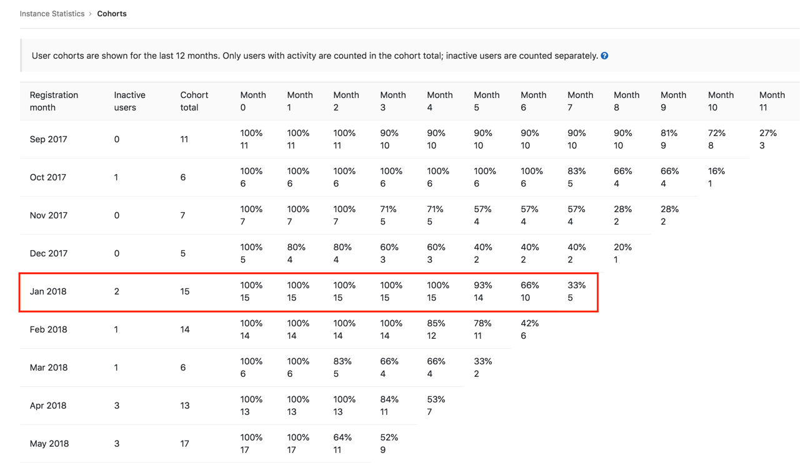

# Cohorts

> [Introduced](https://gitlab.com/gitlab-org/gitlab-ce/issues/23361)
in GitLab 9.1.

As a benefit of having the [usage ping active](../admin_area/settings/usage_statistics.md),
GitLab lets you analyze the users' activities over time of your GitLab installation.

## Overview

How do we read the user cohorts table? Let's take an example with the following
user cohorts.

For the cohort of Jan 2018, 15 users have been added on this server and have
been active since this month. One month later, in Feb 2018, all 15 users are
still active. 6 months later (Month 6, July), we can see 10 users from this cohort
are active, or 66% of the original cohort of 15 that joined in January.

The Inactive users column shows the number of users who have been added during
the month, but who have never actually had any activity in the instance.

How do we measure the activity of users? GitLab considers a user active if:

* the user signs in
* the user has Git activity (whether push or pull).
